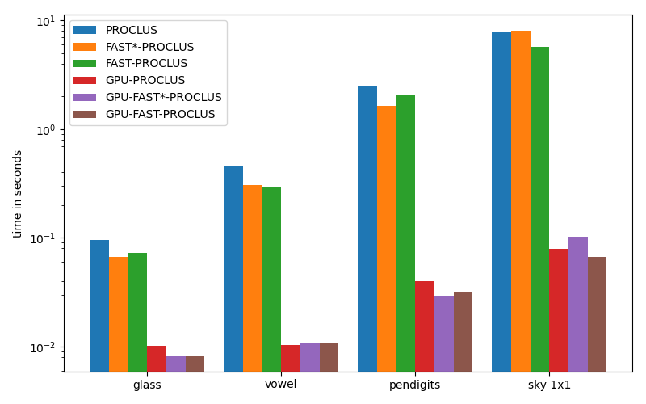

# GPU-FAST-PROCLUS
This repository contains the implementation of PROCLUS, FAST-PROCLUS, FAST*-PROCLUS, GPU-PROCLUS, GPU-FAST-PROCLUS, and GPU-FAST*-PROCLUS.

## Requirements
The implementation has only been tested on a workstation with Ubuntu 20.4 LTS and Windows 10, both with CUDA 10.1. Therefore, the implementation might not run on MAC.

The important packages used are: torch=1.8.0, numpy=1.19.2, and matplotlib=3.3.4. However, it should work for newer versions as well.

## Example
The implementation comes with multiple real-world datasets.

Run a small example with PROCLUS, FAST-PROCLUS, GPU-PROCLUS, and GPU-FAST-PRCLUS:
```
python run_example.py
```
Running the script should take a couple of minutes and result in a plot of the average running times.
The larger dataset is not a part of the example since it would take a long time to run.



## Contact
If you have any difficulties you can contact us at: jakobrj@cs.au.dk
